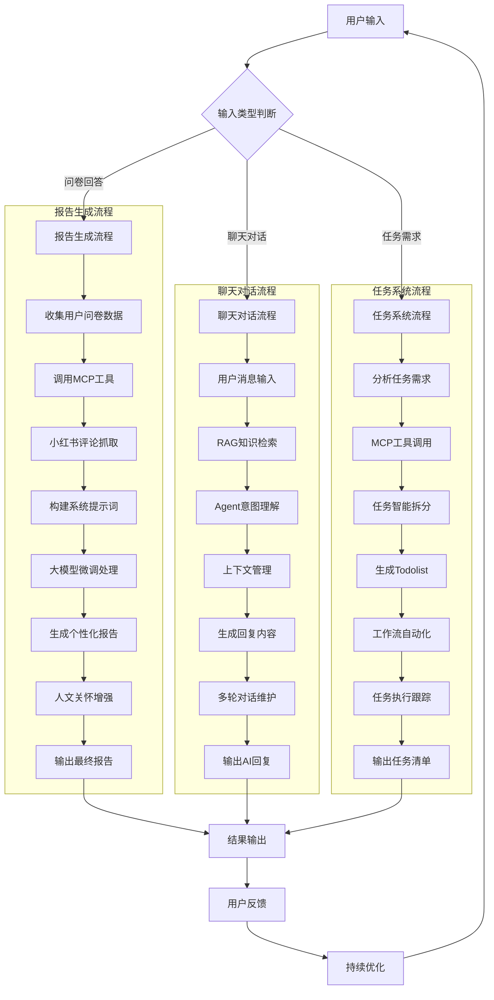
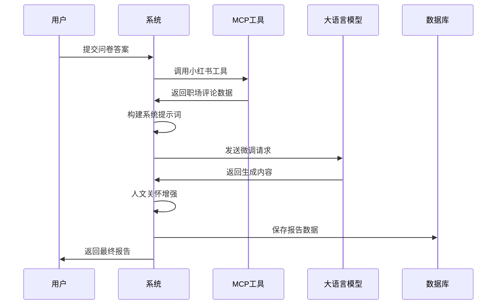
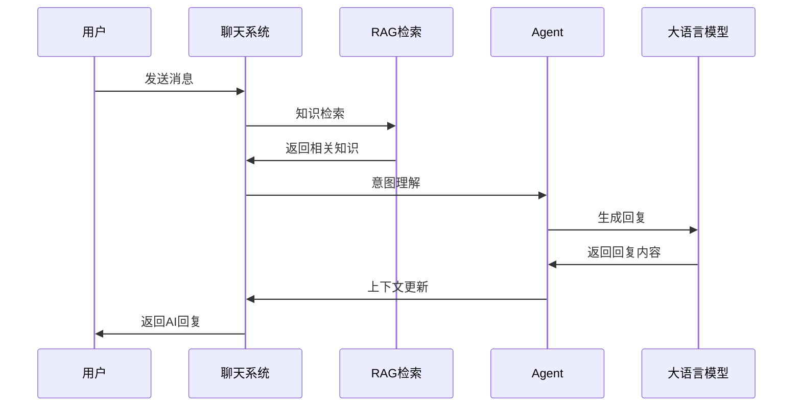
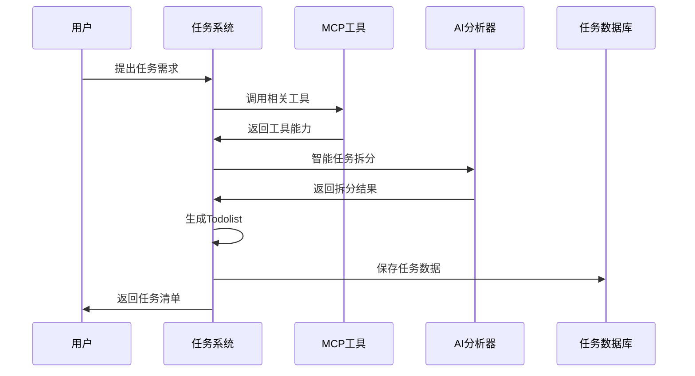
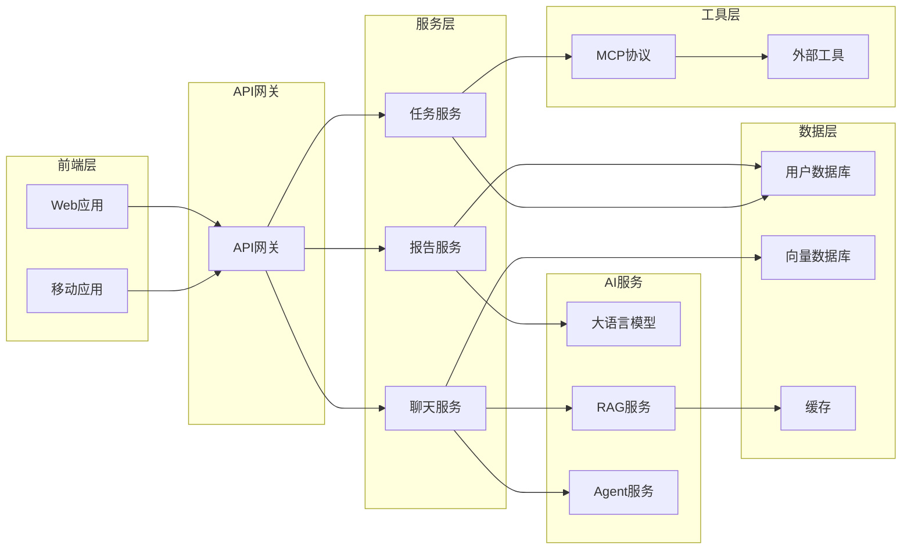

# DouDou AI技术实现流程图

## 核心流程实现

## 技术实现细节

### 1. 报告生成模块实现

### 2. 聊天对话模块实现

### 3. 任务系统模块实现

## 关键技术点

### MCP工具集成
- **小红书评论抓取**: 通过MCP协议调用，获取真实职场反馈
- **工具能力扩展**: 支持多种外部工具的快速集成
- **协议标准化**: 统一的工具调用接口，便于维护

### AI技术融合
- **RAG + Agent**: 结合检索和智能体，提供准确智能的服务
- **大模型微调**: 针对特定领域优化，提升生成质量
- **上下文管理**: 维护对话状态，实现连贯交互

### 工作流自动化
- **智能任务拆分**: 将复杂任务分解为可执行的子任务
- **自动化执行**: 逐步实现任务流程的自动化处理
- **持续优化**: 基于用户反馈不断改进系统性能

## 部署架构

### 部署架构详细说明

#### 1. 前端层 (Frontend Layer)
- **Web应用**: Vue.js响应式界面，支持PC端访问
- **移动应用**: uni-app跨平台应用，支持iOS/Android

#### 2. API网关 (API Gateway)
- **统一入口**: 请求接入、负载均衡、安全控制
- **技术栈**: Kong/Nginx + 中间件

#### 3. 服务层 (Service Layer)
- **报告服务**: 问卷处理、AI报告生成
- **聊天服务**: 对话管理、RAG检索集成
- **任务服务**: 任务创建、拆分、跟踪

#### 4. AI服务 (AI Service Layer)
- **大语言模型**: GPT/Claude等AI推理服务
- **RAG服务**: 向量检索增强生成
- **Agent服务**: 智能体、意图理解

#### 5. 工具层 (Tool Layer)
- **MCP协议**: 标准化工具调用接口
- **外部工具**: 小红书API、任务管理工具等

#### 6. 数据层 (Data Layer)
- **用户数据库**: 用户信息、问卷数据存储
- **向量数据库**: 知识库向量化存储
- **缓存系统**: Redis缓存，提升响应速度

### 技术特点
- **高可用**: 服务冗余、自动恢复、负载均衡
- **可扩展**: 微服务架构、容器化部署
- **安全性**: 多层防护、数据加密、权限管理
