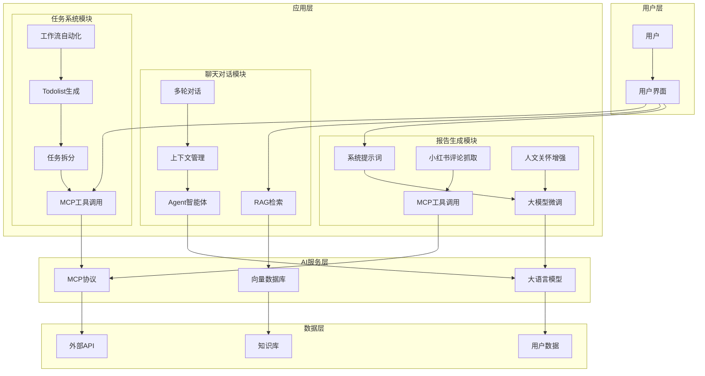

# DouDou AI技术架构图

## 整体架构概览

## 技术模块详解

### 1. 报告生成模块
- **系统提示词**: 通过精心设计的提示词引导大模型生成个性化报告
- **大模型微调**: 基于特定领域数据进行模型微调，提升报告质量
- **MCP工具调用**: 集成小红书等平台工具，抓取职场相关评论
- **人文关怀增强**: 结合真实用户反馈，使报告更具温度和实用性

### 2. 聊天对话模块
- **RAG检索**: 基于检索增强生成，提供准确的知识回答
- **Agent智能体**: 智能对话管理，理解用户意图并执行相应操作
- **上下文管理**: 维护多轮对话状态，提供连贯的对话体验
- **多轮对话**: 支持复杂的交互流程，实现深度对话

### 3. 任务系统模块
- **MCP工具调用**: 集成各种外部工具，扩展任务处理能力
- **任务拆分**: 将复杂任务分解为可执行的子任务
- **Todolist生成**: 自动生成任务清单，提升工作效率
- **工作流自动化**: 逐步实现任务流程的自动化处理

## 技术优势

1. **模块化设计**: 各模块独立，便于维护和扩展
2. **工具集成**: 通过MCP协议集成多种外部工具
3. **智能化程度高**: 结合多种AI技术，提供智能化服务
4. **可扩展性强**: 支持新工具和服务的快速集成
5. **用户体验优**: 注重人文关怀，提供温暖的服务体验

## 应用场景

- **职场新人**: 提供个性化成长建议和任务指导
- **职场老手**: 帮助优化工作流程，提升效率
- **团队管理**: 支持团队任务分配和进度跟踪
- **个人成长**: 结合AI分析，制定个性化发展计划
